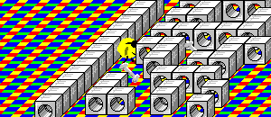



## Haunted Maze 3D

### Description

A pacman style game from isometric view! Camera follows the player! A very clever AI system that uses the ghosts 'line of sight' so that they really do 'see' you - and an exclamation mark appears on thier head when they do! Sound FX and level editor included - 30 different styles of level (that's a fair bit of artwork for just me!). Graphics run at a fair frame rate and it's all done w/o Direct-X or other controls!!!
 
### More Info
 
You run away from the ghosts with the arrow keys, collecting bones. The levels are stored in files and they are loaded from the level selectin form. You can use the level editor to create and save your own levels!

You can see a tutorial on how I made the graphics of this game at www.hispalace.fsbusiness.co.uk/tutorials/isometrictut.htm (my website)

An isometric view of the level with the camera at your location! Ghosts hunt you down and you can see thier level of confusion by the uses of question marks etc.

             |
---                |---
**Submitted On**   |2000-04-09 00:42:56
**By**             |[Simon Price](https://github.com/Planet-Source-Code/PSCIndex/blob/master/ByAuthor/simon-price.md)
**Level**          |Intermediate
**User Rating**    |3.6 (25 globes from 7 users)
**Compatibility**  |VB 5\.0, VB 6\.0
**Category**       |[Games](https://github.com/Planet-Source-Code/PSCIndex/blob/master/ByCategory/games__1-38.md)
**World**          |[Visual Basic](https://github.com/Planet-Source-Code/PSCIndex/blob/master/ByWorld/visual-basic.md)
**Archive File**   |[CODE\_UPLOAD53114282000\.zip](https://github.com/Planet-Source-Code/simon-price-haunted-maze-3d__1-7668/archive/master.zip)

### API Declarations

BitBlt, sndPlaysound

